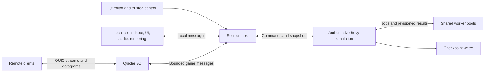

# Multiplayer and embedded servers

Status: proposed architecture and delivery plan. This document does not implement networking or claim that the existing runtime is a multiplayer server. Phase 0 (transport spike and extraction inventory) and incremental Phase 1 progress are recorded in [multiplayer-phase0.md](multiplayer-phase0.md). Runtime simulation registration, clocks, headless tests and fixed-step actor and run-context sensing are implemented. A native [LAN spectator slice](multiplayer-lan.md) now attaches to the running world and replicates settled actor state; Saved project opt-in and a guest limit now gate hosting controls and admission for each run; controllable players and full gameplay replication remain planned.

Research date: 2026-10-02.

## Recommendation

Give every running game a private authoritative simulation, including singleplayer. A local client provides input, rendering, audio and interface presentation. A project opts into multiplayer authoring and hosting; an ordinary singleplayer project opens no network listener and shows no multiplayer controls.

For an eligible project, **Open to LAN attaches a Quiche endpoint to the simulation that is already running**. It does not reload the project, press the green flag again, recreate the host's actor, or reset blocks, variables, physics or plugins. Closing LAN removes remote connections while the host continues playing the same world.

Use Bevy ECS and its scheduler. Keep the block VM confined to its simulation thread, and move independent ECS work and background jobs onto worker pools. Take Hytale's separation of responsibilities and world ownership as inspiration without replacing Bevy with Hytale's ECS or reproducing its voxel-specific design.

The first shipping target is native desktop LAN multiplayer in both 2D and 3D, plus a headless dedicated server using the same simulation. Browser clients, internet rendezvous and relays follow explicit milestones. Gameplay authority, player ownership and timing contracts come before networking polish.

## 1. What the Hytale research establishes

Hytale's public material spans different engines. Its 2024 Flecs/C++ explainer now explicitly identifies itself as outdated; use it as historical design context. Current official documentation describes a Java server API. Do not combine those generations into an asserted description of today's engine. [Historical ECS explainer](https://hytale.com/news/2024/6/summer-2024-technical-explainer-hytale-s-entity-component-system-opwpcamdi), [current documentation](https://docs.hytale.com/).

| Finding from primary sources | Consequence for Blockloom |
| --- | --- |
| Hytale's hardware guide describes singleplayer as running both client and server, with simulation on the server. | Use the same authoritative gameplay path for solo, integrated hosting and dedicated hosting. [Hardware guide](https://hytale.com/news/2025/12/hytale-hardware-requirements). |
| The current server manual says each world has its own main thread and offloads parallel work to a shared pool. | One owner for mutable world state, with bounded background work and explicit commit points. Multiple active worlds can be added later. [Server manual](https://support.hytale.com/hc/en-us/articles/45326769420827-Hytale-Server-Manual). |
| `EntityTickingSystem` supports archetype queries, command buffers and optional worker-thread ticking with declared write access. | Parallelize systems with disjoint access, rather than running every actor's arbitrary scripts concurrently. [ECS API](https://docs.hytale.com/api/com/hypixel/hytale/component/system/tick/EntityTickingSystem). |
| Tick APIs take `dt` in seconds. `TickingThread` exposes configurable TPS, and `World` exposes time dilation separately. | Separate elapsed game time, simulation cadence and deliberate speed changes. These interfaces support the principle; they do not prove that every Hytale mechanic is invariant under every TPS change or overload. [Ticking API](https://docs.hytale.com/api/com/hypixel/hytale/component/system/tick/TickingSystem), [thread API](https://docs.hytale.com/api/com/hypixel/hytale/server/core/util/thread/TickingThread), [world API](https://docs.hytale.com/api/com/hypixel/hytale/server/core/universe/world/World). |
| The manual identifies QUIC over UDP and directs proxy authors to Netty QUIC. Netty's current native QUIC implementation is built on Quiche and BoringSSL. | Use Quiche directly from Rust. The documented Netty-to-Quiche dependency supports the user's choice; the manual alone does not identify the exact Quiche revision Hytale ships. [Server manual](https://support.hytale.com/hc/en-us/articles/45326769420827-Hytale-Server-Manual), [Netty native QUIC README](https://github.com/netty/netty/blob/4.2/codec-native-quic/README.md). |

The useful pattern is an authoritative ECS simulation, local or remote clients, controlled world ownership, worker jobs and duration-based gameplay. Hytale's public API is evidence for those interfaces, not a complete implementation specification or a performance guarantee for Blockloom.

## 2. Starting point in Blockloom

| Existing code | What can stay | What must change |
| --- | --- | --- |
| `blockloom-runtime/src/lib.rs::add_world` | Shared world assembly for editor and player; Bevy ECS; both dimension pipelines | Split simulation registration from window, GPU, audio and UI presentation. It currently registers all of them together. |
| `world.rs`, `dim2.rs`, `dim3.rs` | Fixed simulation, Rapier, actor lifetimes, parenting and settled poses | Move authority and sensing out of frame-dependent client schedules; extract presentation effects and headless collision construction. |
| `engine.rs::Engine`, core VM, sensing | VM/codegen semantics and thread-local reporter context | Separate the large `NonSend` engine into simulation-owned script state, ordinary ECS resources and client state. Keep `Rc` VM data on its owner thread. |
| `scene.rs::World::fixed_rate`, `SceneComponent::Physics` | Existing scene-authored simulation frequency | Keep this distinct from server wake frequency, snapshot rate and game speed. |
| `input.rs`, `sense.rs::Sensors`, VM events | Named actions, input bindings and event vocabulary | Input and interface state currently represent one player. Add player identities, ownership and per-player context. |
| `PhysicsPose`, `PrevPose`, interpolation | Rendering between authoritative poses | Add snapshot buffering and reconciliation without feeding interpolated poses back into server physics. |
| `blockloom-protocol` | Trusted editor/runtime control over pipes or local channels | Introduce a separate, bounded game network protocol. The current editor protocol is version 29 and contains privileged editor operations. |
| `Project`, `ProjectFile`, `wire.rs` | Project identity, scene index and document compatibility | Add project-wide multiplayer capability through every serialization and wire path, not just `World`. |
| `save.rs` | Explicitly saved variables and project identity | Its per-player file is currently keyed by project ID on the local machine. It is not a multiplayer world checkpoint or a server-owned player database. |
| VM, Rust scripts, codegen and plugin hooks | One authoritative execution path for each | Add player/time context, headless capabilities and explicit presentation routing across all paths. |
| Qt settings and Game view; pack/build; shell/MCP | Existing editor and automation surfaces | Add opt-in settings, session controls, build eligibility and command schemas. |

The existing `FixedUpdate` is a good foundation. It does not by itself isolate simulation from rendering: collision relay and sensor publication currently occur in `Update`, and gameplay, graphics and sound effects share the same engine and effect flow. A headless server needs a real extraction of those dependencies.

The repository explicitly keeps the VM `!Send`. Preserve that rule: construct it inside the server thread and publish owned snapshots across threads. Moving the simulation's owner to its own thread does not require making its internals thread-safe.

## 3. Where multiplayer belongs

### 3.1 Project capability, session settings and actor components

Use three separate scopes:

| Scope | Contents | Location |
| --- | --- | --- |
| Project capability | Multiplayer enabled, player limit, late-join policy, player template, replication defaults, approved simulation profile | `Project.multiplayer`, persisted in `ProjectFile`, pack and wire representation; default disabled for old projects |
| Host session | Private or LAN, selected interface/port, display name, admission policy, connected players | Runtime session state and local host preferences; credentials and current listener state are not project assets |
| Actor behavior | Player control, ownership, replication visibility, optional replication overrides | Actor components and inspector sections shown when multiplayer is enabled |

Add **Multiplayer** to `ProjectSettingsDialog.qml` and `SettingsFields.qml`. It belongs alongside General at project scope because scenes share a session and player roster. Keep gravity and the existing fixed rate in scene Physics. Put snapshot frequency and bandwidth limits under advanced multiplayer settings, with usable defaults.

Suggested project model, illustrative rather than finalized Rust:

```text
MultiplayerSettings {
    enabled: false,
    max_players: 8,
    allow_late_join: true,
    player_template: optional actor/template reference,
    replication_profile: Standard,
    simulation_profile: ExistingSceneRate,
}
```

Eight players is an initial product default to validate, not a measured server capacity. Store stable references and validate that referenced templates exist across scene changes.

Enabling multiplayer opens a short setup flow: choose an actor as the player template, choose the player limit, and check compatibility. For standard games, joining creates one instance of that template per player; the author can later choose custom server-side join logic for board games, spectators or games without a player body. An actor and a connection are different things.

Defaults should make a simple cooperative game work: server-owned world actors, one controlled actor per player, shared physical state, and camera/UI for the local player. Advanced replication controls are optional. Enabling the setting alone cannot infer how a game's global keyboard handlers, score or pause menu should behave; preflight identifies those choices.

### 3.2 Player-facing placement

- A disabled project has its existing Play and pause flows, with no Host, Join or Open to LAN controls.
- An enabled project's local game starts privately. The editor Game view and packaged player's session menu expose **Open to LAN** while playing.
- The LAN dialog shows session name, player limit, admission choice and selected network interface. Advanced settings expose the port. Successful opening shows reachable addresses and connection information.
- A session panel shows players, ownership, latency, kick controls and **Close LAN**. Closing warns that guests will disconnect, then preserves the host's run.
- A multiplayer-enabled packaged game offers **Join game** in its entry/session menu: discovered compatible LAN games and a direct address/invite entry. The entry menu remains a local presentation surface before a remote connection exists.
- Editor multiplayer testing offers multiple local clients and simulated latency/loss. It never exposes backend editing commands to guests.

The editor does not need a global multiplayer switch, and multiplayer is not an installable gameplay plugin. Transport and authority are engine infrastructure; projects opt into their player-facing capabilities.

Capability changes apply to the next run. Once an enabled private run exists, opening or closing LAN needs no restart. Editor authoring may continue while hosting, but changed scripts, graphs, content and schemas are staged for the next run; the active session retains its content revision. Initially disable live gameplay hot reload while guests are connected rather than invalidating their baseline silently.

## 4. Runtime architecture



`SessionHost` owns admission, player identities, endpoint lifetime and the authoritative instance. The simulation thread owns one Bevy world, both dimension pipelines as needed, its VM/compiled logic, scripts, plugins and game state. Local and remote clients consume the same replication model and submit the same validated input types.

The local path uses bounded in-process messages and immutable shared data, bypassing packet serialization, encryption and sockets. It still exercises authority, ownership, lifecycle and snapshot application. Do not keep a second solo-only gameplay implementation. A joined client runs presentation and optional prediction, never an independent authoritative VM over the server's actors.

The Qt Game view continues using its existing Linux/Windows graphics handoff. Its Bevy renderer becomes a client of the simulation. Other desktop launches can host both roles in one process or launch the server as a child; those are deployment choices with the same game messages. Editor preview while stopped remains a local editing mode and opens no listener.

Avoid duplicating the entire authored project and every asset per thread. Share immutable content by `Arc`; retain small render replicas of visible live actors. Reuse an in-memory full baseline for local clients and serialize only remote baselines. Measure resident memory, local input latency and allocation cost against the existing player before making the split the default.

### 4.1 Proposed crate boundaries

| Crate/module | Responsibility |
| --- | --- |
| `blockloom-core` | Serializable multiplayer settings, player IDs, component/block models, input contracts and validation without sockets or GPU |
| `blockloom-net-protocol` | Bounded binary messages, schema/version negotiation, entity IDs, snapshot and event contracts; no editor command dispatcher |
| `blockloom-net` | Native Quiche endpoint, discovery, TLS identity, timers, pacing, connection queues and transport adapters |
| `blockloom-simulation` | Headless Bevy world, physics, gameplay schedules and simulation snapshots; extracted incrementally from runtime |
| `blockloom-runtime` | Presentation client, editor preview, platform integrations, local host assembly and packaged client launcher |
| `blockloom-server` | Small headless executable that assembles the same simulation and Quiche host |

Start with internal registration/modules while extracting dependencies; create `blockloom-simulation` when it can build independently without renderer, window, audio-device or Qt dependencies. Headless must mean GPU-free, not merely a hidden window. Separate Bevy features and asset preparation accordingly. Mesh-derived colliders and navigation must be loadable or cooked without GPU uploads.

An optional native `multiplayer` feature brings in Quiche for hosting/joining. Multiplayer-enabled desktop player staging includes it; singleplayer-only staging may omit it. Runtime settings still keep the endpoint and its I/O thread inactive until needed. Gate native networking dependencies out of browser builds.

## 5. Threading and ECS scheduling

Use one owner thread per active simulation instance, plus shared bounded worker pools and a separate native transport event loop. Initially a session has one active scene/world. A saved Blockloom scene is not automatically a concurrently ticking Hytale world.

Keep these responsibilities on the simulation owner initially:

- VM/codegen scheduler, global variables, actor ID allocation and event ordering.
- Native/portable script and plugin calls under their existing serialization guarantees.
- Authoritative lifecycle, scene switching, parent/component transactions and final application of effects.

Split unrelated data out of `Engine` so Bevy can parallelize systems with declared disjoint reads/writes. Good early candidates are numeric per-entity updates, atmosphere/water sampling, spatial interest collection and immutable snapshot encoding. Background jobs cover content loading, pathfinding, terrain/voxel generation and save compression. Profile before moving a system.

Jobs return owned results carrying instance ID, scene epoch and source revision. The owner applies a result only if it still matches. A late navmesh/terrain result from the outgoing scene cannot mutate the new world. Each Quiche connection has one I/O owner; workers never concurrently mutate its connection object. Network callbacks cannot borrow ECS state or invoke arbitrary game logic.

Use explicit simulation stages:

1. Drain bounded input/control inboxes, validate commands and advance the simulation clock.
2. Publish tick-consistent authoritative sensing and player input context.
3. Run plugin Input/PreSimulation, VM/codegen, scripts, AI and FixedSimulation in documented order.
4. Apply validated gameplay/lifetime/component effects and plugin EffectApplication.
5. Advance physics; collect contacts and apply PostPhysics/parenting/lifecycle consequences.
6. Commit settled poses and state; enqueue newly detected events for the next logical step.
7. Extract per-client state and presentation events, then hand snapshots/jobs to other owners.

Each input edge has a sequence number and is delivered once even if a server wake executes multiple logical steps. Physics contact transitions come from simulation steps rather than client frames. Define the new sensing/contact latency explicitly and verify parity across local, remote and headless runs; do not accidentally run one path with fresher sensing than another.

Preserve defined ordering between scripts and effects. A parallel job's completion order is not a license to change clone IDs, global variable results or broadcast order. Start with serial scripting and deterministic effect merges; unrestricted parallel block execution is outside this plan.

## 6. Game speed, TPS and physics

There are four independent quantities:

| Quantity | Purpose | Initial policy |
| --- | --- | --- |
| Logical simulation frequency | How often gameplay blocks and physics scheduling advance | Preserve the scene's existing `world.fixed_rate`, usually 60 Hz |
| Server driver wake frequency | How often the owner drains work and services due logical steps | Can batch due steps; changing this must not alter game time |
| Replication frequency | How often changed state is sent to clients | Start at 20 Hz, tune from measurements |
| Game speed/time scale | Deliberate slow motion, fast forward or pause | 1 normally; controlled by server policy |

Maintain separate monotonic clocks for wall time and simulation time. Networking timeouts, admission deadlines and local menus use wall time. Gameplay waits, movement, timers and simulation state use simulation time. Start new multiplayer APIs with explicit clock names and expose simulation `delta seconds` to blocks/scripts. Maintain existing UI strand behavior in solo compatibility mode.

For fixed logical step `h = 1 / simulation_hz`, the server accumulates wall elapsed multiplied by the deliberate time scale. While the accumulator contains `h`, execute one complete logical step and advance simulation time by `h`. At driver 30 Hz and simulation 60 Hz, an on-time wake normally runs two logical steps. A ten-second wait still lasts ten game seconds, and a legacy `forever` loop keeps its logical cadence.

Quiche timers, input reception and wall-clock services continue while simulation time is paused. Use high precision/integer durations for accumulated time and transmit simulation timestamps, step index and time-scale revision. A rate/scale change commits at a documented step boundary.

### 6.1 The compatibility limit

Changing the actual logical simulation frequency cannot preserve all existing blocks automatically. `forever { change x by 1 }` performs one change per logical step today. At 30 logical steps per second it moves half as far as at 60. The same applies to frame/tick-count-dependent Rust scripts, plugin hooks and certain random/event sequences.

Therefore:

- Preserve legacy logical frequency by default, even if the transport or driver cadence changes.
- Add per-second motion, delta-time reporters and duration-based gameplay examples. Flag obvious per-tick movement patterns when an author requests a different simulation profile; static analysis cannot prove arbitrary scripts are rate-independent.
- Treat changing logical frequency as an authored quality/performance choice with compatibility warnings and tests, not a game-speed control.
- A future timed-loop construct can specify a fixed gameplay interval independently of server wake frequency. Do not silently rewrite existing `forever` loops.

This delivers cadence-independent game speed without claiming that all games have identical outcomes at different numerical step sizes. A lower driver frequency also does not magically reduce the cost of executing the same number of gameplay steps.

### 6.2 Physics and overload

Keep bounded fixed physics steps. Preserve current cadence first; for supported lower logical frequencies, validate Rapier substeps so a 30 Hz gameplay profile need not integrate physics in a single large 33 ms step. Higher speed schedules more due fixed steps, rather than multiplying every physics timestep into a large unstable jump. Client interpolation follows simulation timestamps.

Cap catch-up work per scheduling slice and yield to service input/control. Retain time debt rather than silently skipping gameplay or claiming elapsed waits that physics has not simulated. Drop obsolete snapshots, reduce optional interest/detail work and report overload. Sustained overload requires an explicit server policy: reject additional load, pause, or enter a diagnosed slow-simulation mode. The last choice means game time falls behind wall time; it must be visible in diagnostics.

No architecture can simulate unlimited work in fixed real time. TPS-agnostic duration semantics prevent incidental speed changes; they do not remove CPU limits or make physics identical at every rate.

## 7. Player model and authority

Introduce separate IDs for `PlayerId`, transient connection, session, world/scene epoch and network entity. Actor document IDs remain authoring identifiers. Allocate live network entity IDs on the server with a generation so a delayed packet cannot address a replacement entity. Preserve VM clone IDs and translate them through the server's live mapping.

Useful actor concepts:

- `PlayerController`: this actor consumes input belonging to a player.
- `Owner`: server-assigned player association for input, personal state and routing.
- `Replication`: shared, owner-only or explicitly excluded presentation, with optional field/rate overrides.

Ownership grants input association, not authority to write position, damage, inventory or arbitrary variables. Physical gameplay state stays server-authoritative. A non-replicated actor can still participate in server gameplay; exclusion is a visibility decision, not a way to run hidden authoritative client scripts.

For multiplayer-enabled projects, establish the host's local `PlayerId` and controlled actor when the private run starts. That mapping survives Open to LAN. Remote joins follow server policy and spawn a template instance or invoke custom join logic. Disconnects apply a configured cleanup policy; initially delete the departing player's transient controlled actor after leave handlers and release ownership. Reconnect support can retain a server-issued identity and bounded state lease.

### 7.1 Input and blocks

Replace the single global input snapshot with player-indexed input. Existing key/action reporters on a player-owned actor read its owner's input. Unowned actors do not implicitly read whichever client's packet arrived last; multiplayer preflight asks the author to use a player-specific reporter or event.

Add player join/leave hats, player count, actor owner, this event's player and targeted player action/UI events. Explicit event context survives waits and broadcasts according to a documented rule; do not infer a player from ambient thread-local state after another strand has run. Server assigns source identity and validates the actor/interaction target.

Clients send named action values, aim intent and bounded UI commands. Clamp finite axes, reject stale/replayed sequences, bound input lead, and validate ownership, cooldowns and scene epoch. For server-wide key hats, require an explicit multiplayer policy such as host-only or a named player's event; never merge all keyboards into a global held-key set.

Mouse-world positions and client picking are proposed intent. The server validates ray origin, target existence and interaction reach against the authoritative world. Local editor `PreviewInput` continues serving the local presentation/input adapter, but is not the public gameplay protocol.

### 7.2 Cameras, UI, sound and pause

Each client owns its camera, focus, pointer lock, device/gamepad feedback, mixer preferences and presentation UI. Reinterpret a player template's Camera component as a camera for its owner; preserve the legacy sole camera for ordinary singleplayer projects.

Server gameplay creates addressed presentation events and view models: a shared speech bubble, a sound at an actor, a screen for one player, or a shared score. Every effect must have an explicit audience. Local animations and cosmetic effects can continue between snapshots; their gameplay consequences and replicated state remain authoritative.

Separate local UI layout/focus from server UI state used by gameplay. UI widget events carry player and widget IDs, sequence and validated values. Existing UI blocks that mutate gameplay run on the server with player context. Local pause menus remain responsive without allowing clients to run the world VM or submit arbitrary effects.

Opening a local menu while LAN is open does not pause everyone. Existing `pause game` means an authoritative global pause subject to game/server policy; add local-menu/pause-presentation APIs for multiplayer menus. Dedicated servers keep network/admission/administrative wall-clock services alive during global pause.

GPU luminance, HDR/device state, cursor lock and local sound playback reporters cannot be authoritative headless gameplay inputs. Classify reporters by execution domain. Keep device reads in client presentation; diagnose their use in server gameplay and offer explicit nonauthoritative telemetry where useful. Never let a connected client's GPU or UI focus determine global physics.

## 8. Quiche transport and the game protocol

Quiche supplies low-level QUIC connection processing; the application supplies I/O, its event loop and timers. Configure ALPN, flow control, stream limits, idle timeouts and pacing explicitly. `tokio-quiche` is an upstream option for the native I/O adapter, subject to a small raw-game-protocol spike rather than assuming its HTTP/3 defaults fit the game. [Quiche documentation](https://docs.quic.tech/quiche/), [Cloudflare's async integration](https://blog.cloudflare.com/async-quic-and-http-3-made-easy-tokio-quiche-is-now-open-source/).

Use an application ALPN such as `blockloom-game/1`, separate from the editor protocol. Native games use raw QUIC initially; HTTP/3 is not required for the native game protocol. Pin the dependency and validate its BoringSSL/CMake/toolchain requirements on supported desktop targets before committing packaging recipes. [Quiche repository](https://github.com/cloudflare/quiche).

| Traffic | Delivery | Application rule |
| --- | --- | --- |
| Compatibility, admission, player roster, scene barriers | Reliable ordered control stream | Small messages, independent of content downloads |
| Entity spawn/despawn, component changes, durable gameplay events | Reliable streams with explicit ordering scope | Lifecycle/event IDs, deduplication, acknowledgements and epochs |
| Content and initial full state | Separate reliable bounded streams | Chunked transfer, hashes, size caps and gameplay priority |
| Frequent transforms/velocities and held-input state | QUIC DATAGRAM | Sequence/timestamp, latest useful data wins |
| Input edges and acknowledged interactions | Sequenced command path with retry until acknowledged | Deliver once to gameplay; held-state updates cannot substitute for a lost click/jump |

QUIC DATAGRAM does not provide delivery, ordering or game state reconstruction. Size packets using Quiche's negotiated maximum writable datagram length; an entire scene snapshot will usually need multiple independently useful packets. Enable datagrams explicitly and refuse an unsupported native replication profile with a clear error. [Connection API](https://docs.quic.tech/quiche/struct.Connection.html), [configuration API](https://docs.quic.tech/quiche/struct.Config.html).

Streams remove ordering dependencies between unrelated streams, but streams and datagrams still share connection congestion capacity. Budget content traffic, prioritize input/control, obey pacing, discard expired queued state and disconnect peers whose bounded reliable queues cannot recover. No blocking network send is permitted on the simulation thread.

Use a bounded binary schema with explicit length framing for streams, collection/string limits and finite-number validation. Define a network schema version independent of `PROTOCOL_VERSION`, plugin ABI, script ABI and pack version. A handshake negotiates protocol, engine/schema compatibility, game ID/build hash, simulation profile, plugin replication schemas and required content before a player can submit gameplay input.

### 8.1 Authentication and safe joins

LAN hosting creates or loads a local server certificate and presents a verifiable fingerprint/invite. Discovery is an untrusted hint. A host-provided invite carries the expected certificate fingerprint and a high-entropy admission token; a short human code requires rate-limited verification. An IP-only first connection explicitly establishes trust in that server identity. Do not globally disable certificate verification to make self-signed LAN hosting work.

Map connection authentication to a server-issued player identity. Names and IP addresses are not identities. Account-free LAN can use local profile keys and server-issued reconnect credentials scoped to this session/world. Keep tokens out of broadcast discovery, logs and packs. Initially require the matching trusted game build and installed runtime dependencies; do not auto-download and execute native scripts, compiled logic or plugin libraries from a server.

Apply per-peer message/connection/stream/asset limits and admission timeouts. No gameplay mutations in replayable 0-RTT. Guests cannot access editor dispatch, project files, shell commands or plugin editor commands. Multiplayer safety follows from a narrow validated gameplay protocol, not from assuming QUIC encryption makes client claims trustworthy.

## 9. Open to LAN and late join

Session state: `Private -> Opening -> Listening -> Closing -> Private`, with transport failure returning to Private while simulation continues. Peer count is separate from listener state. A bind/admission failure never destroys the game or migrates it into a new server instance.

### 9.1 Opening and closing

1. Check the project supports multiplayer, the running build/plugin loadout is eligible, and hosting is permitted on this target.
2. Prepare TLS identity/admission state and bind UDP on explicitly selected LAN interfaces. Do not default to every public/VPN interface.
3. Start native LAN discovery advertisement only after bind succeeds. Advertise game/protocol/build identity, name, endpoint and occupancy, with expiry; no join secrets.
4. Continue stepping the existing world. Admit each peer through content/identity checks and the late-join barrier below.
5. Close LAN by stopping discovery, refusing admission, revoking session guest credentials and gracefully disconnecting remote peers. Apply normal leave cleanup; keep the local player and all other world state alive.

Allow discovery via an mDNS/DNS-SD service such as `_blockloom._udp`, plus direct addresses where multicast is unavailable. Test IPv4, IPv6, multiple interfaces and same-machine multiple clients. The bind interface is a default exposure scope, not proof that a router cannot forward traffic; admission validation remains necessary.

Open to LAN does not imply opening a router port, UPnP, internet listing or firewall administration. Report bind failure and blocked connectivity separately. Quiche is a transport, not a rendezvous, hole-punching or relay service.

### 9.2 Late join without resetting the world

1. Authenticate and negotiate matching content/schemas. Assign a connection, but do not spawn a player yet.
2. At a simulation boundary capture a full join baseline for epoch `E`, step `T`: live actor identities/templates, current components, settled transforms/velocities, relevant variables, globals, hierarchy, scene, dynamic tile/terrain/plugin state, clocks, pause/scale and durable presentation state.
3. Transfer that immutable baseline while the world continues. Buffer bounded changes after `T`, or restart the baseline if the peer falls too far behind. Never block the world waiting for a download.
4. Require baseline application acknowledgement, then stream/apply the contiguous lifecycle/state tail. Deltas reference an acknowledged baseline; never assume a lost datagram established one.
5. At a scheduled commit, admit the player, create/assign its actor and fire join/start-as-player handlers once. Release gameplay input only after its actor and current epoch are installed on the client.

A joining client needs visible live state, not server VM stack frames or private variables. The server continues every suspended strand. Keep server-only variables, inventory secrets and unneeded content out of public replicas; replicated variable/view-model fields are schema-selected.

Support scene switches through a reliable epoch barrier. Initially every player transitions to the same active scene; reject old-epoch input/deltas/jobs and resnapshot where necessary. Handle joins during transitions by waiting at the admission barrier or restarting against the new epoch. Individual player instances and cross-world travel are a later feature, not an implicit meaning of current `switch scene`.

## 10. Replication and responsiveness

Start with server authority, remote interpolation and immediate local camera/UI response. This is enough to validate the architecture, but a responsive action-game release also needs prediction for standard player movement.

Build an explicit replication registry for built-in components and approved plugin schemas. Defaults include shared actor identity, visual setup, transform, visibility and animation/presentation state. Server-only script state and generic private variables are not automatically broadcast. Snapshot deltas compare to client-acknowledged state; periodic keyframes/resynchronization recover missing state.

Use reliable lifecycle IDs and tombstones. A datagram arriving before spawn can be buffered briefly or discarded; it cannot construct an actor with missing components. Despawn, teleport, ownership change and scene change invalidate prediction/history appropriately.

For standard player controllers, clients retain sequenced input and predict a narrowly defined movement state. The server sends authoritative pose plus last processed input; clients rewind to that state, replay remaining inputs and smooth visual corrections. Other actors interpolate from timestamped snapshots with a bounded adaptive delay. Do not predict arbitrary block graphs, world physics, inventory, plugin effects or native script side effects.

Share a movement controller kernel between server and prediction and define collision/quantization tolerances. General Rapier simulation across machines is not assumed bit-for-bit deterministic. Competitive hit rewind, rollback fighting games and lockstep RTS are separate networking profiles, not promises of the initial cooperative profile.

Coordinate the movement kernel with [the physics and character controller plan](physics-and-character-controller-plan.md). Its proposed controller/motor contracts are a design dependency, not an assumption that every part is implemented. Until a controller has a tested replay contract, replicate its authoritative movement and mark prediction unavailable for it.

Interest management must be gameplay-aware: per-player location/camera regions, owner-only data and always-relevant game state. An actor may be out of render interest yet still affect physics, timers and scripts. Existing camera-based streaming cannot unload authoritative state because the host looks away; maintain simulation residency around all players and independent gameplay requirements.

Start with bounded full-scene replication for small projects, then add spatial interest and chunk state. Streaming a procedural voxel world requires the plugin contract in the next section. Declare supported size/player limits from measurement rather than making a universal performance claim.

## 11. Plugins, scripts, saves and dedicated builds

### 11.1 Execution domains and compatibility

Extend plugin capability/schema metadata with server simulation, client presentation and replication support. Server runs gameplay modules/reporters/hats; clients run only approved presentation contributions. Existing Input through PostPhysics hooks belong to simulation. RenderExtraction/Presentation belong to clients, so a module that combines both needs an explicit split or is ineligible for headless multiplayer until adapted.

Audit plugin services individually. CPU world generation, spatial queries and collision outputs need headless implementations; GPU meshing, render handles and window services are client capabilities. GPU compute that affects gameplay needs a server CPU path or a separately supported server capability, never an assumed GPU in every dedicated server.

For opaque plugin records, the plugin declares public/owner/server-only fields, bounded snapshot serialization, version/migration policy, live deltas and restore behavior. Core cannot infer a network representation from `PluginRecord`. Missing multiplayer support is a preflight reason, not silent omission. Record version negotiation does not automatically imply compatible runtime behavior.

For the voxel plugin specifically: server owns edits, collision and gameplay-relevant chunk state; clients build meshes. Late join uses seed/generator identity plus authoritative edit/chunk state, with hashes and revisioned changes. Do not rely on cross-target procedural determinism without tests. Fracture, debris lifetime and navigation consequences originate on the server.

Native scripts and compiled blocks execute on the server from trusted installed/build artifacts. Update player/time APIs consistently in VM, codegen, sensing, script ABI and plugins. Keep the compiled scheduler's documented differences visible; test the same multiplayer scenarios through both schedulers. Bump the relevant ABI only when its contract changes, and editor protocol version when local control messages change.

### 11.2 Saves and persistence

Separate authored project files, world-instance state and player profiles. The editor owner lock/revision system coordinates project editing; it does not implement game networking or synchronize concurrent live worlds.

Keep current singleplayer saved-variable behavior for old games. Multiplayer games explicitly choose shared server variables versus per-player persisted fields. Do not copy the host's personal save into every joining player's actor. Migrate old data only through a documented policy; player template clone IDs are not durable account keys.

Server storage is keyed by stable game/world-instance identity and verified player identity. Use one writer per world, consistent boundary snapshots, atomic commit and flush on orderly shutdown. Network late join reads live snapshots; it does not require or imply a complete disk checkpoint implementation.

Initial persistence can support the declared shared/player save fields. Complete world resume additionally requires physics state, spawned actors, plugin state and VM/compiled/script checkpoint contracts. Native script stacks are not automatically serializable. Label save capability accurately; Open to LAN itself must preserve the uninterrupted in-memory run regardless of disk persistence support.

### 11.3 Dedicated server and distribution

Ship a separate server target using the same `SessionHost` and simulation. It loads an installed game pack, binds a configured endpoint, runs without a local player/GPU/audio device, and exposes local administrative commands and metrics. A sample invocation is:

```text
blockloom-server --game <game-folder> --data <world-data-folder> --bind <address:port>
```

The built game advertises engine/protocol/content identity and a headless-compatible dependency closure. New multiplayer metadata needs a pack version or required-feature gate so an old player cannot silently ignore it and run incompatible gameplay. Preserve existing singleplayer packs. Server and client packaging should exclude editor-only artifacts and distribute only their approved domains.

Desktop build eligibility includes Quiche/toolchain support, trusted matching client artifacts, both dimensions and script/plugin compatibility. Android multiplayer needs its own transport build and lifecycle tests before it is offered. A browser may join later but cannot host a native UDP LAN endpoint.

## 12. Browser and internet boundaries

A browser client cannot use the native raw-QUIC socket API. Add a WebTransport adapter and a Quiche-backed HTTP/3/WebTransport server endpoint that translates to the same game messages. Quiche's support for QUIC and HTTP/3 does not by itself establish that it provides the entire WebTransport session layer; prove CONNECT/settings/datagram framing and browser interoperability in a separate spike. [WebTransport specification](https://www.w3.org/TR/webtransport/).

Browser joins also need secure-context, origin and certificate handling. The specification offers server certificate hashes with constraints, including a certificate validity period of at most two weeks for that mechanism. An existing self-contained HTML export that runs from disk is not automatically a supported LAN multiplayer client. Test hosted HTTPS and local-file behavior explicitly, then state the supported launch contexts. [WebTransport specification](https://www.w3.org/TR/webtransport/).

Internet hosting can first offer an explicit publicly reachable UDP endpoint and manual network setup. Later work adds authenticated rendezvous, invites, NAT probing and relay fallback. Keep LAN usable without accounts or cloud service availability. QUIC connection migration is not a substitute for NAT traversal. Do not fold matchmaking, a public server browser, chat or host migration into the first LAN milestone.

## 13. Delivery plan and acceptance gates

| Phase | Work | Gate before proceeding |
| --- | --- | --- |
| 0. Prove the boundaries | Quiche native round-trip/TLS/datagram spike on desktop targets; inventory headless dependencies, gameplay reporters and VM/codegen clocks; record CPU/memory/input baseline | Native transport builds; a realistic list of extraction blockers and compatibility decisions exists |
| 1. Private authoritative simulation | Extract simulation/presentation registration; bounded local input/snapshots; move sensing/contacts to simulation; clocks and pause; headless 2D/3D harness | Solo and headless gameplay agree; render stalls do not stall simulation; owner-thread VM rule remains true; legacy packs still run |
| 2. Multiplayer authoring and players | Project settings/serialization, owner/controller/replication components, per-player input/UI/camera, join/leave blocks, preflight | Two local test clients control distinct actors with isolated UI and input; shared gameplay remains authoritative; old projects stay singleplayer |
| 3. Quiche LAN and late join | Versioned protocol, authentication, endpoint state machine, discovery/direct join, baselines/deltas, scene epochs, Open/Close LAN UI | Open mid-run, join, scene switch and close without host reset; loss/reordering and failed binds do not corrupt the world |
| 4. Action-game quality and headless shipping | Standard movement prediction/reconciliation, replication budgets/interest, dedicated target, VM/codegen/script parity, build/version gates | Tested 2D and 3D cooperative games feel responsive under the defined network matrix; server builds/runs GPU-free; no unsupported execution path is silently accepted |
| 5. Extension and scale contracts | Approved plugin replication/headless domains, voxel/terrain state, save scoping, bounded jobs and system parallelism | Eligible plugins pass join/leave/scene/save tests; large-world limits and worker gains are measured; unsupported plugins produce actionable preflight errors |
| 6. Browser and wider networks | WebTransport proof and adapter, HTTPS/origin/certificate UX, Android qualification, internet endpoint/rendezvous/relay work | Each offered target/network mode passes its own compatibility and failure tests |

The first usable internal slice is Phase 3: a basic eligible game can open its running world to LAN. The initial native multiplayer release requires Phases 1-4 plus compatibility coverage for every plugin/gameplay feature it advertises. Phase 5 can ship incrementally; plugin eligibility remains strict until its adapter passes. No calendar estimate is credible until extraction and transport spikes expose the actual dependency work.

### 13.1 Concrete validation scenarios

- A disabled legacy project loads/saves/builds with no network socket or multiplayer chrome. Its blocks and explicit saved variables retain their meaning.
- Run privately for a minute with a suspended wait, moving rigid body, clone, changed component and global score. Open LAN, join a second client and verify the host's state/IDs/strands continue. Close LAN and repeat. The green flag and world-start hooks must not fire again.
- Run two clients holding different keys and interacting with different menus. Check ownership, camera, focus, saved values and UI event context before and after a strand yields.
- Validate joins during a clone/delete, attach/detach, teleport, plugin edit and 2D-to-3D scene transition. Compare admitted state to the authoritative baseline/tail, not just visible positions.
- At fixed logical 60 Hz, vary driver and replication cadences and client rendering rates. Compare movement, waits, timers, script/plugin durations and event counts. At different logical rates, verify time-based contracts and explicitly expected legacy per-tick differences.
- Introduce transport delay, jitter, loss, duplication and reordering through a reproducible harness. Initial target matrix: 0/50/100 ms round-trip latency, up to 20 ms jitter and 0/1/5 percent loss; validate worse sustained conditions fail cleanly rather than treating this as a universal network promise.
- Stop rendering briefly while simulation continues; introduce bounded slow jobs, content transfers and slow readers. Verify stale state is dropped, reliable queues remain bounded and overload metrics are honest.
- Replay input, forge another actor's ID, submit NaN/oversized payloads, use an old scene epoch and attempt privileged messages. Verify deterministic rejection without world mutation or server crash.
- Exercise IPv4/IPv6, occupied port, wrong fingerprint, wrong build, full game, disabled late join, unreachable host, host exit and lost peer. Each error has a useful client-facing reason.
- Run a desktop dedicated server on a machine with no display/GPU/audio device. Test the same game through VM and compiled logic, plus eligible Rust scripts and portable/native plugins.

Track server step time by stage, time debt, job backlog, per-peer reliable/state queue sizes, bytes/second, RTT/loss, baseline time/size, resident memory, input acknowledgement latency and prediction corrections. Measure against existing performance diagnostics and a reproducible project set; avoid asserting scalability from an empty-world benchmark.

## 14. Implementation map and first decision

Start in these places:

- `blockloom-runtime/src/lib.rs`, `engine.rs`, `world.rs`, `dim2.rs`, `dim3.rs`: simulation extraction, collision/sensing schedule and headless asset boundary.
- `blockloom-core/src/project.rs`, `scene.rs`, `scene_components.rs`, `components.rs`, `input.rs`, `sense.rs`, `wire.rs`: capability, actor/player data and serialization.
- `blockloom-core/src/blocks.rs`, `fields.rs`, `value.rs`, `vm/`, `codegen/`, `script/`: new player/time/block contracts and execution parity.
- Runtime `ui*`, `sound.rs`, `cinematic.rs`, `streaming.rs`, `plugins.rs`, `plugin_services.rs`: execution domains, pause, per-client effects and all-player residency.
- `blockloom-app/src/commands.rs`, `dispatch.rs`, `state.rs`, `runtime.rs`, `shell.rs`, `mcp/src/registry.ts`: settings/session commands, status and schemas.
- `blockloom-qt/qml/ProjectSettingsDialog.qml`, `SettingsFields.qml`, `TopBar.qml` and Game view controls: opt-in authoring and LAN/session UI; register new QML files in `build.rs`.
- Core `pack.rs`, `build.rs`, player staging recipes and runtime `player.rs`: pack compatibility, separate server export and join/local-host launch paths.
- Plugin API/host/SDK: declared execution domains, bounded replication and save adapters, with ABI changes only where required.

Proposed trusted backend commands are `set_multiplayer`, `open_lan`, `close_lan`, `session_status`, `list_players` and `kick_player`. Register their typed arguments in dispatch/shell/MCP together, publish a session DTO separately from the authored project, and route them through the existing ordered backend command path. In the editor, Stop owns server shutdown; Close LAN owns only network exposure. Remote guest gameplay messages cannot call these administrative commands.

Implement the private headless simulation and two local players first. They resolve Blockloom's real authority and ownership problems before the transport adds latency and failures. The durable product decision is: **multiplayer capability belongs to the project; LAN exposure belongs to the running session; player association and replication belong to actors/components.**
